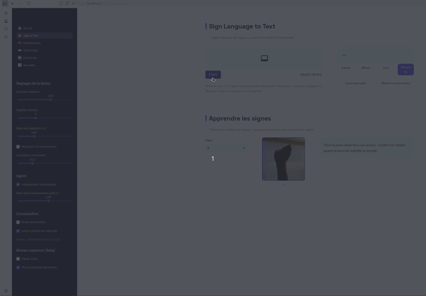
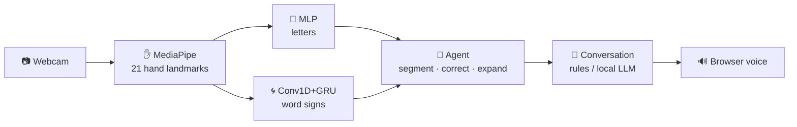
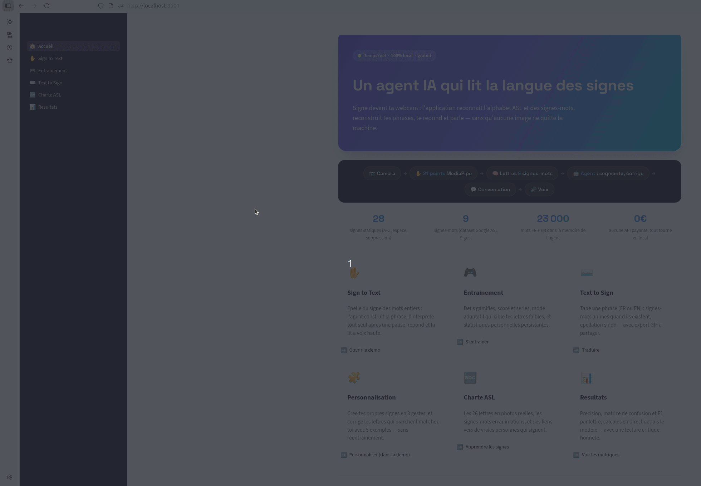

<div align="center">

# 🤟 ASL Sign Agent

**A real-time AI agent that reads American Sign Language — fingerspelling + word signs — interprets it, talks back, and speaks. 100% local, 100% free.**




</div>

---

## What it does

Sign in front of your webcam. The app recognizes the **ASL alphabet** (fingerspelling) and a vocabulary of **word signs**, rebuilds your sentences with a local NLP **agent** (word segmentation, spell correction, slang expansion — *"ILOVE U" → "I love you"*), **answers you** in a conversation (local rules, or Ollama if installed) and **speaks the reply out loud**. It also translates text back to signs, gamifies practice with adaptive drills, and lets you teach it **your own signs** in 3 gestures — all without a single API key, and without any image ever leaving your machine.



## Features

| | |
|---|---|
| ✋ **Sign to Text** | Real-time letter recognition (28 static signs) + motion-gated J/Z + word signs, with live tuning sliders |
| 🤖 **Interpreting agent** | Autonomous (triggers on pause), explainable (reasoning journal), bilingual FR/EN, ~23k-word vocabulary, abbreviation expansion |
| 💬 **Conversation + voice** | Replies via local rules, upgrades itself automatically if [Ollama](https://ollama.com) is running; browser speech synthesis |
| 🎮 **Practice mode** | Gamified word challenges, streaks, **adaptive drills targeting your weak letters**, personal confusion matrix, silent labeled-data collection |
| 🧩 **Personalization** | Record your own signs (3 gestures, no retraining) · fix a letter that fails for you with 5 examples (few-shot k-NN overlay) |
| ⌨️ **Text to Sign** | Hybrid rendering: animated word signs when known, fingerspelling otherwise · FR↔EN translation · animated GIF export |
| 📊 **Results** | Live metrics: accuracy, confusion matrix, per-letter F1 — with an honest in-distribution vs cross-signer reading |

## Demos

| 🎮 Practice mode | ⌨️ Text to Sign |
|---|---|
|  |  |
| *Adaptive drills, streaks and a personal confusion matrix* | *Word signs animated, the rest fingerspelled — GIF export included* |

## Results

| Model | Task | Evaluation | Accuracy |
|---|---|---|---|
| MLP (landmarks) | 29 static classes | in-distribution test split | **99.23 %** |
| Conv1D + GRU | word signs (9 classes) | **unseen-signer split** (grouped by participant) | **75.5 %** |

> The contrast between these two numbers is deliberate. A k-NN also reaches 99.2 % on the letters — a telltale sign of near-duplicate data — so that score measures in-distribution performance only. The word-sign score, evaluated on signers never seen during training, is the honest cross-person number. The word-sign vocabulary extends to 24 signs via the download script. Full analysis in the project report.

## Quickstart (2 minutes)

Requires **Python 3.11** (TensorFlow 2.15 / MediaPipe 0.10.9 compatibility).

```bash
git clone https://github.com/YOUR_USERNAME/asl-sign-agent.git
cd asl-sign-agent
python3.11 -m venv .venv && source .venv/bin/activate
pip install -r requirements_app.txt
streamlit run app.py
```

That's it — letter recognition, the agent, conversation, voice, practice mode and personalization all work out of the box (the trained models ship with the repo). The home page shows a **setup checklist** telling you what optional pieces are missing.

## Optional add-ons

<details>
<summary><b>📸 Sign images (chart, Text-to-Sign photos)</b></summary>

Download the <a href="https://www.kaggle.com/datasets/grassknoted/asl-alphabet">ASL Alphabet dataset</a> (Kaggle, ~1 GB) and place the <code>Asl_Sign_Data/</code> folder inside the repo (it is gitignored). The app finds it automatically and auto-curates the best photos.
</details>

<details>
<summary><b>🌀 Word signs (up to 24 conversational signs)</b></summary>

1. <code>pip install kaggle pyarrow</code>, put your Kaggle API token in <code>~/.kaggle/</code>, and accept the rules of the <a href="https://www.kaggle.com/competitions/asl-signs">asl-signs competition</a>.
2. <code>python download_signs_dataset.py</code> — targeted download (~few hundred MB, resumable).
3. <code>python make_word_previews.py</code> — generates the sign animations.
4. Run <code>notebooks/03_entrainement_signes_mots.ipynb</code> — trains the GRU with an unseen-signer split and saves the model.
5. Enable the <b>Word signs</b> toggle in the app sidebar.
</details>

<details>
<summary><b>🦙 Richer conversation (Ollama)</b></summary>

```bash
curl -fsSL https://ollama.com/install.sh | sh
ollama pull llama3.2:1b        # light — or qwen2.5:3b if you have RAM to spare
```
The app detects it automatically — no configuration. Force a specific model with <code>ASL_OLLAMA_MODEL=name streamlit run app.py</code>.
</details>

<details>
<summary><b>📓 Retraining the letter model</b></summary>

With <code>Asl_Sign_Data/</code> in place, run <code>notebooks/01_entrainement_evaluation.ipynb</code> (extraction → normalization → augmentation → MLP → full evaluation). The landmark CSV it produces also powers the live Results page.
</details>

## Project structure

```
asl-sign-agent/
├── app.py                     # Streamlit entry point (multipage navigation)
├── views/                     # One file per page (home, sign-to-text, practice, ...)
├── agent.py                   # The interpreting agent (segmentation, correction, journal)
├── conversation.py            # Dialogue engine (local rules + optional Ollama)
├── asl_core.py                # Normalization, sentence state machine, J/Z & thumbs-up detectors
├── word_signs.py              # Word-sign features, GRU inference, custom-sign matching
├── personal.py                # Few-shot letter personalization (k-NN overlay)
├── practice.py                # Gamified training engine + labeled-data collection
├── sign_photos.py             # Automatic photo curation & enhancement
├── assets/vocab_{fr,en}.txt   # Embedded frequency vocabularies (~23k words)
├── notebooks/                 # Training & evaluation notebooks (01, 02, 03)
├── tests/  ·  .github/        # Pytest suite + CI (Python 3.11)
└── docs/GUIDE_FR.md           # Detailed French user guide
```

## Honest limitations

- **Fingerspelling + a closed word-sign vocabulary is not sign language translation.** ASL/LSF have spatial grammar and non-manual features; sentence-level translation remains an open research problem. This project states its scope explicitly.
- The 99 % letter score is **in-distribution**; the practice mode collects your own labeled samples precisely to measure the honest cross-user gap.
- J/Z use a pose-gated motion heuristic; a sequence model trained on trajectories is the natural next step.

## Privacy

Everything runs locally: video frames, landmarks, personal samples and conversation history never leave your machine. Personal data files are gitignored by default.

## Credits

[MediaPipe](https://mediapipe.dev) · [ASL Alphabet dataset](https://www.kaggle.com/datasets/grassknoted/asl-alphabet) (GPL-2.0, not redistributed) · [Google ASL Signs](https://www.kaggle.com/competitions/asl-signs) (competition data, not redistributed) · [wordfreq](https://github.com/rspeer/wordfreq) · [Ollama](https://ollama.com) · Real-signer videos linked from [SignASL.org](https://www.signasl.org)

*M2 Computer Science & Data Science project — MIT licensed.*
