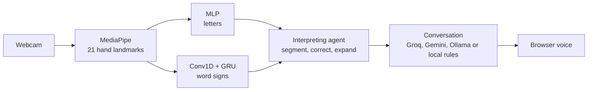

<div align="center">

# 🤟 ASL Sign Agent

**A real-time AI agent that reads American Sign Language (fingerspelling and word signs), interprets it, talks back and speaks.**

[](https://sign-agent.streamlit.app/)


[](https://github.com/nazmussama19-lgtm/Asl-sign-agent/actions/workflows/ci.yml)


</div>

<p align="center">
  
</p>

## What it does

Sign in front of your webcam. The app recognizes the **ASL alphabet** (fingerspelling) and a set of **word signs**, rebuilds your sentence with an **interpreting agent** (word segmentation, spell correction, shorthand expansion: *"ILOVE U" → "I love you"*), **answers you** with an AI model and **reads the answer out loud**. It also turns text back into signs, gamifies practice with adaptive drills, and lets you teach it **your own signs** in 3 gestures.



## Features

| | |
|---|---|
| **Sign to Text** | Real-time letter recognition (28 static signs), motion-based J and Z, word signs, live tuning sliders |
| **Interpreting agent** | Triggers itself after a pause, explains every decision, bilingual English/French, ~23k-word vocabulary, shorthand expansion |
| **Conversation and voice** | Replies with **Groq** (gpt-oss-120b, gpt-oss-20b as backup), **Gemini**, a local **Ollama** model or built-in rules, with automatic fallback. A **comparison mode** shows Groq and Gemini side by side. Replies are read by the browser voice |
| **Practice** | Gamified word challenges, streaks, **adaptive drills that target your weak letters**, personal confusion stats |
| **Personalization** | Record your own sign in 3 gestures (no retraining), fix a letter that fails for you with 5 examples (few-shot k-NN overlay) |
| **Text to Sign** | Animated word signs when known, fingerspelling otherwise, English/French translation, GIF export |
| **Results** | Accuracy and per-sign F1-score of the letter model |

## Demos

**Practice mode**: adaptive drills, streaks and personal statistics.

<p align="center"></p>

**Text to Sign**: word signs animated, the rest fingerspelled, with GIF export.

<p align="center"></p>

## Results

| Model | Task | Accuracy |
|---|---|---|
| MLP on hand landmarks | 28 static signs (A–Z, space, delete) | **99.23 %** |
| Conv1D + GRU | 24 word signs | **86 %** |

The word-sign model is trained on the [Google ASL Signs](https://www.kaggle.com/competitions/asl-signs) dataset, which covers up to **250 signs**. We downloaded and evaluated **24 signs**; the deployed demo ships a lighter **9-sign** model to keep the app small and fast.

## Try it online

**[sign-agent.streamlit.app](https://sign-agent.streamlit.app/)**: click **Start** under the video and allow your camera. The app may take a minute to wake up if nobody has used it recently.

## Run it locally

Requires **Python 3.11** (TensorFlow 2.15 and MediaPipe 0.10.9). The environment takes about 1.5 to 2 GB.

```bash
git clone https://github.com/nazmussama19-lgtm/Asl-sign-agent.git
cd Asl-sign-agent
python3.11 -m venv .venv && source .venv/bin/activate      # Windows: .venv\Scripts\activate
pip install -r requirements.txt
streamlit run app.py
```

Letter recognition, the agent, conversation (local rules), voice, practice and personalization work out of the box: the trained models ship with the repo. The **Home** page shows what is active. To add Groq or Gemini, copy `.streamlit/secrets.toml.example` to `.streamlit/secrets.toml` and fill in the keys.

## Deployment (Streamlit Community Cloud)

1. On [share.streamlit.io](https://share.streamlit.io), create an app from this repository, main file `app.py`.
2. In **Advanced settings**, choose **Python 3.11**.
3. In **Secrets**, paste the content of [`.streamlit/secrets.toml.example`](.streamlit/secrets.toml.example) and fill in:
   - `GROQ_API_KEY` from [console.groq.com/keys](https://console.groq.com/keys) (free tier),
   - `GEMINI_API_KEY` from [aistudio.google.com/apikey](https://aistudio.google.com/apikey) (free tier),
   - `TURN_URLS`, `TURN_USERNAME`, `TURN_CREDENTIAL` from a TURN provider such as [Metered](https://www.metered.ca/stun-turn) (free tier). Without a relay, the webcam can stay black for visitors on work or mobile networks.

Every key is optional: a missing AI key hides that provider, and the agent falls back to the next one. Model names can be changed in the secrets without touching the code. `requirements.txt` and `packages.txt` are picked up automatically.

## Optional add-ons

<details>
<summary><b>Sign photos (chart, Text to Sign)</b></summary>

Without them, the app uses public-domain drawings from Wikimedia Commons. For real photos, download the <a href="https://www.kaggle.com/datasets/grassknoted/asl-alphabet">ASL Alphabet dataset</a> (Kaggle, ~1 GB) and put the <code>Asl_Sign_Data/</code> folder inside the repo (gitignored). The app finds it and picks the best photos automatically.
</details>

<details>
<summary><b>Word signs (up to 24 signs)</b></summary>

1. <code>pip install kaggle pyarrow</code>, put your Kaggle API token in <code>~/.kaggle/</code>, and accept the rules of the <a href="https://www.kaggle.com/competitions/asl-signs">asl-signs competition</a>.
2. <code>python download_signs_dataset.py</code>: targeted download (a few hundred MB, resumable).
3. <code>python make_word_previews.py</code>: generates the sign animations.
4. Run <code>notebooks/03_word_signs_training.ipynb</code>: trains the GRU and saves the model.
5. Turn on <b>Word signs</b> in the app sidebar.
</details>

<details>
<summary><b>Fully local conversation (Ollama)</b></summary>

```bash
curl -fsSL https://ollama.com/install.sh | sh
ollama pull llama3.2:1b
```
Detected automatically, with no configuration. Force a model with <code>ASL_OLLAMA_MODEL=name streamlit run app.py</code>.
</details>

<details>
<summary><b>Retraining the letter model</b></summary>

With <code>Asl_Sign_Data/</code> in place, run <code>notebooks/01_letters_training_evaluation.ipynb</code> (extraction, normalization, augmentation, MLP, evaluation). The landmark CSV it produces also lets the Results page recompute its metrics live.
</details>

## Project structure

```
Asl-sign-agent/
├── app.py                     # Streamlit entry point (multipage navigation)
├── views/                     # One file per page: home, sign_to_text, practice_mode, text_to_sign, chart, results
├── ui.py                      # Visual identity, letter tiles, cached models, sign images
├── agent.py                   # Interpreting agent (segmentation, correction, reasoning log)
├── conversation.py            # Conversation engine: Groq, Gemini, Ollama, local rules, fallback, comparison
├── asl_core.py                # Normalization, sentence state machine, J/Z and thumbs-up detectors
├── word_signs.py              # Word-sign features, GRU inference, custom-sign matching
├── personal.py                # Few-shot letter personalization (k-NN overlay)
├── practice.py                # Gamified practice engine and labeled-data collection
├── sign_photos.py             # Automatic photo selection and enhancement
├── assets/vocab_{fr,en}.txt   # Frequency vocabularies (~23k words)
├── notebooks/                 # 01 letters training, 02 real-time demo, 03 word-signs training
├── tests/                     # Pytest suite (core modules, conversation engine with mocked APIs)
├── .streamlit/                # Theme and secrets template
└── docs/                      # User guides (English, French) and demo GIFs
```

## Limitations

- **Fingerspelling and a closed set of word signs are not sign language translation.** ASL has a spatial grammar and non-manual features; sentence-level translation is still an open research problem.
- The letter score is measured on the dataset used for training; accuracy on new signers, lighting and cameras is lower. The Practice mode collects your own labeled samples to measure that gap.
- J and Z use a motion heuristic; a sequence model trained on trajectories is the natural next step.
- Personal samples and custom signs are stored on the machine running the app: online, they are shared between visitors and reset when the server restarts.

## Privacy

- **Locally with Ollama**: video, landmarks, personal samples and conversation never leave your machine.
- **Online**: video frames are processed in memory by the server hosting the app and are not recorded. Only the **text** of the conversation is sent to Groq or Gemini when they are used. Translation in Text to Sign uses Google Translate.
- Personal data files are gitignored.

## Documentation

[User guide (English)](docs/GUIDE_EN.md) · [Guide utilisateur (français)](docs/GUIDE_FR.md)

## Credits

[MediaPipe](https://mediapipe.dev) · [ASL Alphabet dataset](https://www.kaggle.com/datasets/grassknoted/asl-alphabet) (GPL-2.0, not redistributed) · [Google ASL Signs](https://www.kaggle.com/competitions/asl-signs) (competition data, not redistributed) · ASL alphabet drawings: public domain, [Wikimedia Commons](https://commons.wikimedia.org/wiki/Category:ASL_letters) (wpclipart.com) · [wordfreq](https://github.com/rspeer/wordfreq) · [Groq](https://groq.com) · [Gemini API](https://ai.google.dev) · [Ollama](https://ollama.com) · Real-signer videos linked from [SignASL.org](https://www.signasl.org)

*M2 Computer Science & Data Science project, MIT licensed.*
